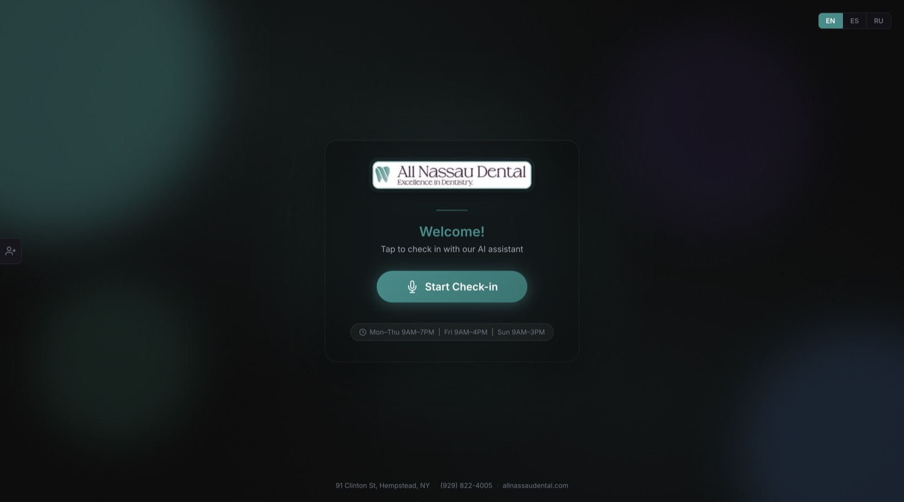
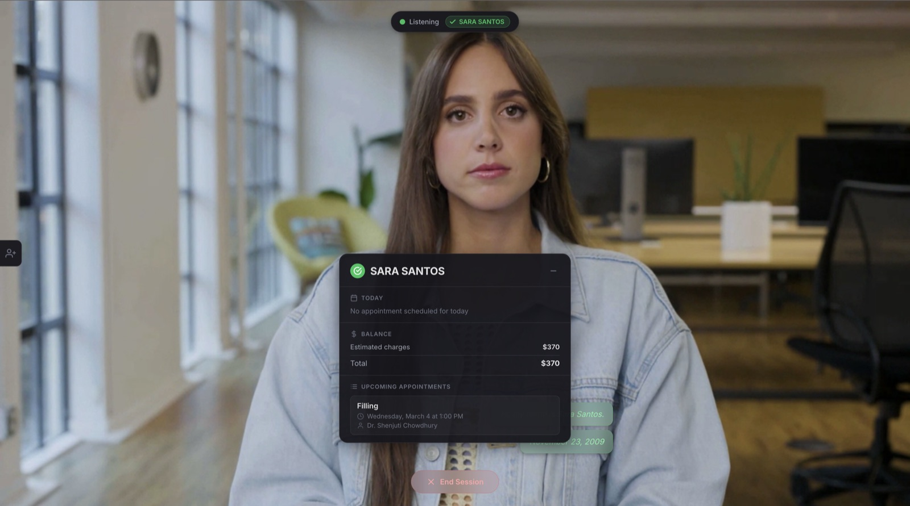

# AI Kiosk — Patient Check-in with Conversational Video Avatar

An AI-powered self-service kiosk for clinics. Patients check in by talking to a **real-time video avatar** — it verifies their identity, pulls up appointments, shows balances, and handles check-in. All by voice, on a touchscreen.

Powered by [Tavus CVI](https://www.tavus.io/) + [Daily.co](https://www.daily.co/) WebRTC + [Open Dental](https://opendental.com/) integration.

    

---

## Screenshots

| Idle Screen | Active Session |
|:-----------:|:--------------:|
|  |  |

> **Idle:** Welcome screen with language selector (EN/ES/RU), clinic branding, and one-tap start button.
>
> **Active:** AI avatar (Emma) talking with the patient. Patient dashboard shows verified name, today's appointment, balance, and upcoming visits — all fetched in real-time from Open Dental.

---

## How It Works

```
┌─────────────┐     WebRTC (Daily.co)     ┌──────────────┐
│   Patient    │◄────── Video/Audio ──────►│  Tavus CVI   │
│   (Kiosk)   │                            │  AI Avatar   │
└──────┬──────┘                            └──────┬───────┘
       │                                          │
       │  React UI                     Tool calls │
       │  (transcript, dashboard)      (webhooks) │
       │                                          │
       ▼                                          ▼
┌──────────────┐     REST API          ┌──────────────────┐
│   Frontend   │◄────────────────────►│     Backend       │
│   React/Vite │                       │  FastAPI + MySQL  │
└──────────────┘                       └────────┬─────────┘
                                                │
                                                ▼
                                       ┌──────────────────┐
                                       │   Open Dental    │
                                       │    MySQL DB      │
                                       └──────────────────┘
```

**Patient flow:**
1. Tap "Start Check-in" → AI avatar appears and greets the patient
2. Avatar asks for name + date of birth
3. Backend runs **3-tier fuzzy matching** against the practice management DB
4. Dashboard card appears with appointment, balance, upcoming visits
5. Patient taps "Check In" or asks the avatar — done in seconds

---

## Features

- **Conversational AI Avatar** — Tavus CVI replica with natural video, lip-sync, and real-time voice responses
- **Fuzzy Name Matching** — 3-tier verification (exact SQL → SOUNDEX → difflib) handles misheard/misspelled names
- **Multilingual** — English, Spanish, Russian (voice + UI)
- **Patient Dashboard** — Real-time card showing appointment details, balance breakdown, and upcoming visits
- **One-Tap Check-In** — Voice-driven or touchscreen
- **Staff Manual Check-in** — Hidden sidebar for front desk override (search by name + DOB)
- **Open Dental Integration** — Direct MySQL queries for patients, appointments, balances, procedures
- **HIPAA Audit Logging** — Every tool call logged with timestamps
- **SMS Reminders** — Twilio integration for appointment reminders
- **Appointment Booking** — Voice-driven appointment requests
- **Screen-Aware AI** — Avatar knows what's displayed on screen and keeps responses brief

---

## Tech Stack

| Layer | Technology |
|-------|-----------|
| **AI Avatar** | [Tavus CVI](https://www.tavus.io/) (Conversational Video Interface) |
| **Video/Audio** | [Daily.co](https://www.daily.co/) WebRTC SDK |
| **Frontend** | React 18 + Vite |
| **Backend** | FastAPI (Python, async) |
| **Database** | MySQL ([Open Dental](https://opendental.com/)) via aiomysql |
| **SMS** | Twilio |
| **Styling** | CSS glassmorphic dark theme |

---

## Project Structure

```
├── backend/
│   ├── main.py              # FastAPI app, routes, session management
│   ├── tools.py             # Tool handlers (verify, check-in, balance, book, SMS)
│   ├── setup_persona.py     # Tavus persona creation (prompt, objectives, guardrails)
│   ├── tavus.py             # Tavus CVI API client
│   ├── db.py                # Async MySQL connection pool
│   ├── audit.py             # HIPAA compliance logging
│   ├── config.py            # Environment settings
│   ├── models.py            # Pydantic request/response schemas
│   ├── requirements.txt
│   └── .env.example
│
├── frontend/
│   ├── src/
│   │   ├── App.jsx              # Root state machine (idle → active → ended)
│   │   ├── index.css            # Global styles (glassmorphic dark theme)
│   │   ├── components/
│   │   │   ├── Avatar.jsx           # Tavus video stream container
│   │   │   ├── PatientDashboard.jsx # Verified patient info card
│   │   │   ├── IdleScreen.jsx       # Welcome screen + language selector
│   │   │   ├── ManualCheckin.jsx    # Staff sidebar for manual lookup
│   │   │   ├── Transcript.jsx      # Live speech captions
│   │   │   ├── Controls.jsx        # Session controls
│   │   │   ├── StatusDot.jsx       # Connection status indicator
│   │   │   └── ActivityBar.jsx     # Tool execution progress
│   │   └── hooks/
│   │       ├── useSession.js        # Backend session lifecycle
│   │       └── useTavusCall.js      # Daily.co + Tavus tool call orchestration
│   ├── package.json
│   ├── vite.config.js
│   └── .env.example
│
├── docs/                    # Screenshots
├── .gitignore
└── README.md
```

---

## Quick Start

### Prerequisites

- **Node.js** 18+
- **Python** 3.10+
- **MySQL** (Open Dental instance)
- **Tavus** API key + Replica ID — [tavus.io](https://www.tavus.io/)
- **ngrok** or similar tunnel (Tavus webhooks need a public URL)

### 1. Backend

```bash
cd backend
python -m venv venv && source venv/bin/activate
pip install -r requirements.txt

cp .env.example .env
# Fill in your Tavus API key, DB credentials, ngrok URL (see Environment Variables below)

# Create AI persona (one-time setup)
python setup_persona.py
# → Copy the printed persona ID into .env → TAVUS_PERSONA_ID

uvicorn main:app --host 0.0.0.0 --port 8000
```

### 2. Frontend

```bash
cd frontend
npm install
cp .env.example .env

npm run dev        # → http://localhost:5173
npm run build      # Production build → dist/
```

### 3. Expose Backend (for Tavus webhooks)

```bash
ngrok http 8000
# Copy https://xxxx.ngrok.io → backend/.env → BACKEND_URL
```

---

## Environment Variables

### `backend/.env`

```env
# Tavus CVI
TAVUS_API_KEY=tvs_xxx
TAVUS_PERSONA_ID=p_xxx          # from setup_persona.py
TAVUS_REPLICA_ID=r_xxx          # from Tavus dashboard

# Open Dental MySQL
DB_HOST=localhost
DB_PORT=3306
DB_USER=root
DB_PASSWORD=
DB_NAME=opendental

# Public URL for Tavus webhooks
BACKEND_URL=https://xxxx.ngrok.io

# Twilio (optional — for SMS reminders)
TWILIO_ACCOUNT_SID=
TWILIO_AUTH_TOKEN=
TWILIO_FROM_NUMBER=+1xxxxxxxxxx

# CORS
FRONTEND_URL=http://localhost:5173

# Session limits (seconds)
MAX_CALL_DURATION=300
PARTICIPANT_LEFT_TIMEOUT=30
```

### `frontend/.env`

```env
VITE_API_URL=http://localhost:8000
```

---

## API Endpoints

### Session

| Method | Endpoint | Description |
|--------|----------|-------------|
| POST | `/api/session/start` | Create Tavus conversation → returns `conversation_url` |
| POST | `/api/session/end` | End active conversation |

### AI Tool Webhooks

These are called by the frontend when Tavus triggers a tool call. Results are injected back into the conversation via Daily.co `conversation.respond`.

| Method | Endpoint | Description |
|--------|----------|-------------|
| POST | `/tools/verify_patient` | Identity verification (name + DOB, 3-tier fuzzy matching) |
| POST | `/tools/get_today_appointment` | Today's appointment details |
| POST | `/tools/check_in_patient` | Mark patient as checked in |
| POST | `/tools/get_balance` | Account balance (outstanding + insurance + estimated) |
| POST | `/tools/get_appointments` | Upcoming appointments list |
| POST | `/tools/book_appointment` | Request new appointment |
| POST | `/tools/send_sms_reminder` | Send SMS reminder via Twilio |

### Staff Manual Check-in

| Method | Endpoint | Description |
|--------|----------|-------------|
| POST | `/api/manual/search` | Search today's patients by last name + DOB |
| POST | `/api/manual/checkin` | Check in appointment by ID |

---

## Fuzzy Name Matching

Voice-to-text often garbles patient names. The verification system cascades through 3 tiers until a match is found:

| Tier | Method | Example |
|------|--------|---------|
| 1 | **Exact** — `LOWER(LName) = LOWER(input)` + DOB | "Ramirez" → "Ramirez" |
| 2 | **SOUNDEX** — MySQL phonetic match + DOB | "Ramiris" → "Ramirez" |
| 3 | **difflib** — Python `SequenceMatcher` (ratio > 0.6) + DOB | "Ramires" → "Ramirez" |

Each tier only runs if the previous returned zero results. DOB is always required as a second factor.

---

## Tavus Tool Call Flow

Tavus CVI webhooks are **one-way** — they hit your backend but don't feed results back to the LLM automatically. This project implements the full orchestration loop on the frontend:

```
1. Avatar decides to call a tool (e.g. verify_patient)
2. Tavus fires tool_call event → Daily.co app-message → Frontend
3. Frontend calls Backend REST API → gets structured result
4. Frontend formats result as human-readable text
5. Frontend injects via Daily.co conversation.respond → back to Tavus LLM
6. Avatar receives the result and speaks the response
```

The frontend acts as the **orchestrator** between Tavus and the backend — this is the key architectural pattern.

---

## Persona Setup

The AI persona is defined in `backend/setup_persona.py`:

- **System prompt** — Personality, clinic context, screen awareness (avatar knows what the patient sees on screen)
- **Objectives** — Structured conversation flow (greet → verify → check-in → help)
- **Tools** — 7 function definitions with parameter schemas
- **Guardrails** — Scope limits, data protection, brevity
- **STT hotwords** — Common patient surnames for better speech recognition
- **Multilingual greetings** — EN / ES / RU

After editing the persona:
```bash
cd backend
python setup_persona.py
# Update TAVUS_PERSONA_ID in .env with the new ID
```

---

## License

MIT
